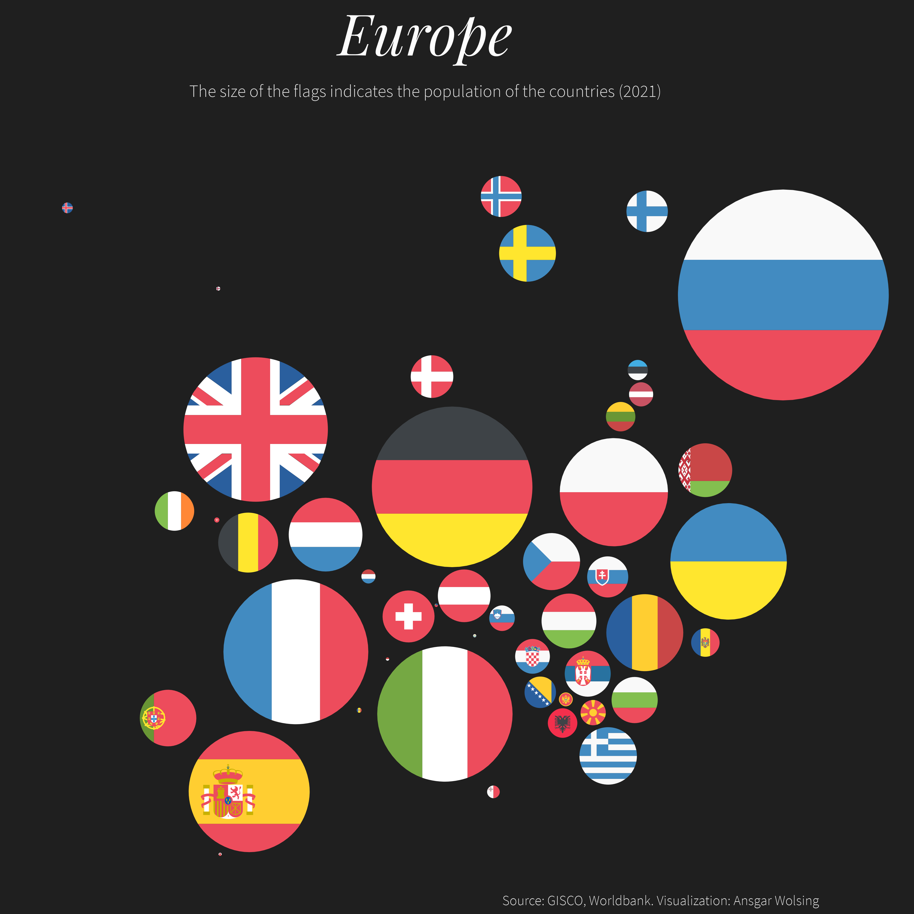

# #30DayMapChallenge2023

My contributions to the #30DayMapChallenge 2023

### 01 Points

### 02 Lines

[{width="300"}](plots/02-lines-with-glow.png)

### 03 Polygons

[{width="300"}](plots/03-polygons.png)

### 04 A bad map

[{width="300"}](plots/04-bad-with-pop-share.png)

### 05 Analog map

[{width="300"}](plots/05-analog-map-IMG_5703-edited.jpg)

### 06 Asia

[{width="300"}](plots/06-asia-dorling-pop.png)

### 07 Navigation

[{width="300"}](plots/07-navigation.png)

### 08 Africa

[{width="300"}](plots/08-africa-dorling-pop.png)

### 09 Hexagons

[{width="300"}](plots/09-hexagons-income.png)

### 10 North America

[{width="300"}](plots/10-north-america-ca-pop-density-with-inset-edited.png)

### 11 Retro

[{width="300"}](plots/11-retro.png)

### 12 South America

[{width="300"}](plots/12-south-america-br-pop-density-lo.png)

### 13 Choropleth

[{width="300"}](plots/13-choropleth-postprocessed.png)

### 14 Europe

[{width="300"}](plots/14-europe-dorling-pop.png)

### 15 OpenStreetMap

[{width="300"}](plots/15-osm-rail.png)

### 16 Oceania

[{width="300"}](plots/16-oceania-mariana-trench.png)

### 17 Flow

[{width="300"}](plots/17-flow.png)

### 18 Atmosphere

[{width="300"}](plots/18-atmosphere.png)

### 19 5 minute map

[{width="300"}](plots/19-5-minute-map-second-vote-share-for-the-afd-in-the-federal-election-2021.png)

### 20 Outdoors

[{width="300"}](plots/20-outdoors.png)

### 21 Raster

[{width="300"}](plots/21-raster-ships-fishing.png)

### 22 North is not always up

[{width="300"}](plots/22-North%20is%20not%20always%20UP%204-5%20small.png)

### 23 3D

[{width="300"}](plots/23-3d-norway-population-edited.png)

### 24 Black & white

[{width="300"}](plots/24-black-white-germany-placenames.png)

### 25 Antarctica

[{width="300"}](plots/25-antarctica-sea-ice-extent.png) [{width="300"}](plots/25-antarctica-shape-of-antarctica.png)

### 26 Minimal

[{width="300"}](plots/26-minimal.png)

### 27 Dot

[{width="300"}](plots/27-dots-penguins-polarbears.png)

### 28 Is this a chart or a map?

[{width="300"}](plots/28-chart-or-map-nfl-dorling.png) [{width="300"}](plots/28-chart-or-map-nfl-lollipop-split.png) [{width="300"}](plots/28-chart-or-map-nfl-with-globes%20#2.png)

### 29 Population

[{width="300"}](plots/29-population-dorling.png)

### 30 "My favourite ..."

[{width="300"}](plots/30-my-favourite.png)
